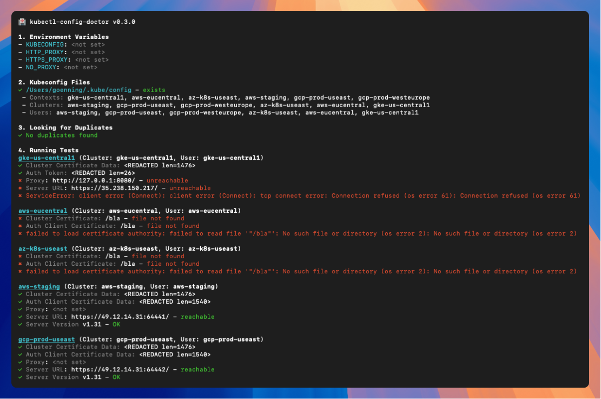

# kubectl-config-doctor

A `kubectl` plugin to validate and test kubeconfigs.


## 💻 Install

`kubectl-config-doctor` can be installed using [Krew](https://github.com/kubernetes-sigs/krew):

```shell
$ kubectl krew install config-doctor
```

## 📝 Intro

If you're having issues connecting to a Kubernetes cluster, there's a good chance that the problem lies in your kubeconfig file. 

`kubectl-config-doctor` is a tool that can help you diagnose common issues with your kubeconfig file, such as:

- Duplicate contexts/clusters/users
- Missing contexts/clusters/users
- Incorrectly formatted kubeconfig files
- Unreachable proxy api
- Unreachable cluster api
- Invalid authentication methods
- Files that don't exist
- ... and more!

## 🚀 Usage

```shell
$ kubectl config-doctor
```

## ✨ Demo



## 📃 License

MIT

## ❤️ Acknowledgement

<a href="https://aptakube.com">
    
</a>